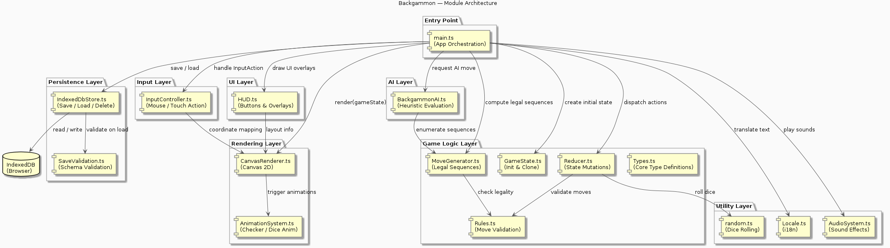
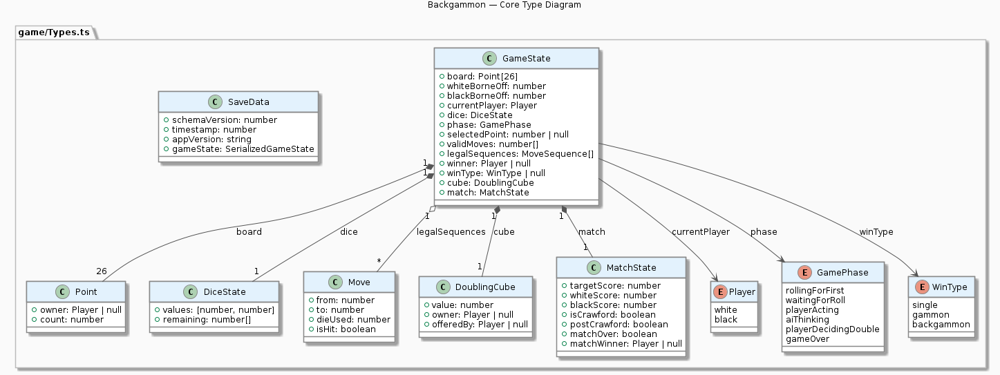
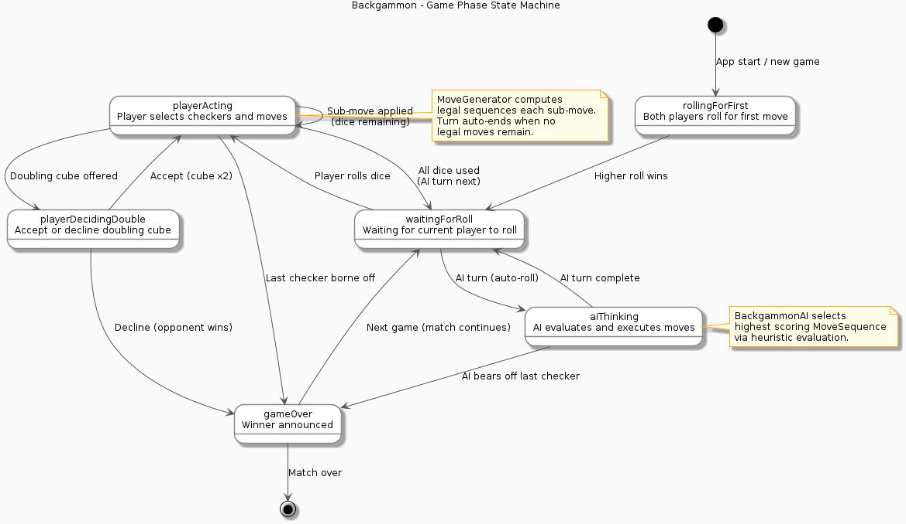
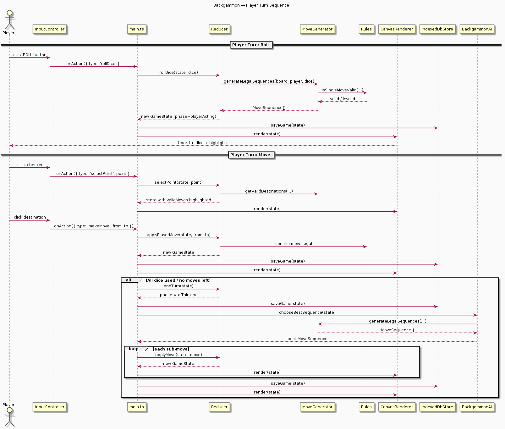

# Backgammon

A fully playable single-player backgammon game (Human vs AI) built with TypeScript, HTML5 Canvas, and IndexedDB. No external libraries or frameworks used.

## Features

- Complete backgammon rules: hit/bar/re-entry, bearing off, doubles (4 moves), higher-die rule
- AI opponent with heuristic scoring
- IndexedDB-based save/restore (auto-save after each move)
- Responsive layout: landscape for wide screens, portrait for narrow screens (Galaxy Fold 7 support)
- Touch support for mobile/tablet
- Robust error handling and recovery

## Architecture Diagrams

### Module Architecture


### Core Type Diagram


### Game Phase State Machine


### Player Turn Sequence


---

## Project Structure

```
backgammon/
├── index.html              # Entry HTML
├── style.css               # Minimal CSS (no framework)
├── tsconfig.json           # TypeScript config
├── README.md               # This file
└── src/
    ├── main.ts             # App entry point
    ├── game/
    │   ├── Types.ts        # Core type definitions
    │   ├── GameState.ts    # Initial state, cloning utilities
    │   ├── Rules.ts        # Move validity, bear-off rules
    │   ├── MoveGenerator.ts # Complete legal sequence generation
    │   └── Reducer.ts      # Pure state transformation functions
    ├── ai/
    │   └── BackgammonAI.ts # Heuristic AI opponent
    ├── render/
    │   └── CanvasRenderer.ts # Canvas 2D rendering (responsive)
    ├── input/
    │   └── InputController.ts # Mouse + touch input handling
    ├── persistence/
    │   ├── IndexedDbStore.ts  # IndexedDB save/load/delete
    │   └── SaveValidation.ts  # Save data schema validation
    ├── ui/
    │   └── HUD.ts          # On-canvas buttons and overlays
    └── utils/
        └── random.ts       # Dice rolling utilities
```

## Building

### Requirements

- Node.js with TypeScript (`npm install -g typescript`)

### Compile

```bash
cd /path/to/backgammon
tsc
```

This compiles all TypeScript files in `src/` to JavaScript in `dist/`.

### Run

Serve the project root with any static server:

```bash
# Using Python
python3 -m http.server 8080

# Using Node.js http-server
npx http-server . -p 8080

# Using VS Code Live Server extension
# Right-click index.html → "Open with Live Server"
```

Then open `http://localhost:8080` in your browser.

## How to Play

1. The game starts with White's (your) turn
2. Click **ROLL** to roll dice
3. Click a white checker to select it (valid moves will highlight)
4. Click a highlighted destination to move
5. If you have a checker on the bar, you must re-enter it first
6. Bear off your checkers when all 15 are in your home board (points 1-6)
7. First player to bear off all 15 checkers wins

## Controls

- **ROLL** button: Roll dice (your turn)
- **New Game**: Start a fresh game (discards current progress)
- **Clear Save**: Delete saved game from IndexedDB

## Rules Implemented

- Standard 24-point board
- Both dice must be used if possible
- Higher die must be used when only one die can be played
- Doubles = 4 moves with the same value
- Blot hitting (opponent's single checker goes to bar)
- Bar re-entry: must re-enter before any other move
- Bearing off: all checkers must be in home board; exact die or higher allowed when no checkers above
- Pass turn when no legal moves exist

## Responsive Layout

- **Width ≥ 600px**: Standard landscape backgammon board layout
  - Points 13-24 on top, 1-12 on bottom
  - White bears off on the left, Black on the right
- **Width < 600px**: Portrait mode for Galaxy Fold 7 folded screen
  - Points 13-24 on top half, 1-12 on bottom half
  - Layout scales to fit narrow screens

The canvas automatically resizes when the Galaxy Fold 7 is folded/unfolded using `ResizeObserver`.

## Save/Restore

- Game state is automatically saved to **IndexedDB** after each action
- On next page load, you'll be prompted to continue or start a new game
- Save data includes schema version for forward compatibility
- Corrupt or invalid save data is safely discarded (app falls back to new game)

## Known Limitations

- No doubling cube
- No match scoring (gammon/backgammon)
- No undo feature
- AI uses heuristic scoring (not Monte Carlo or neural network)
- No sound effects or animations (checkers move instantly)
